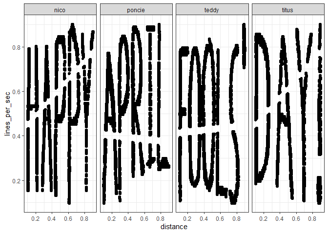
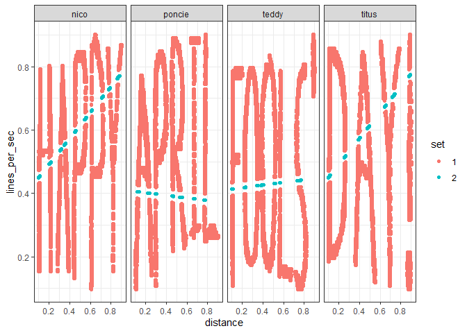
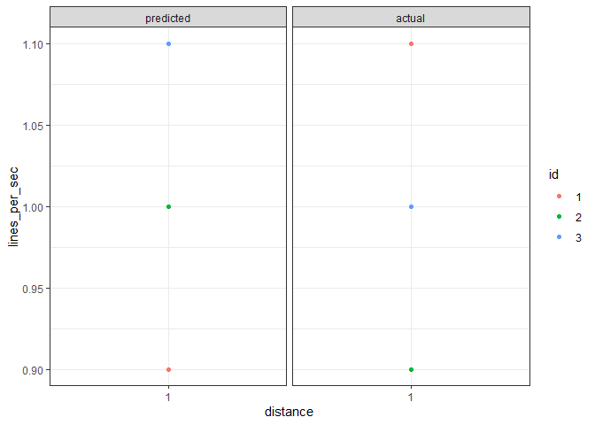
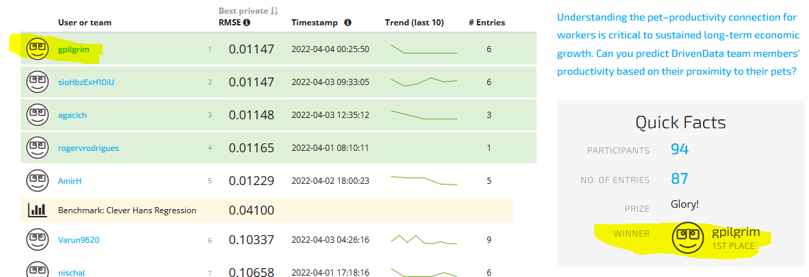
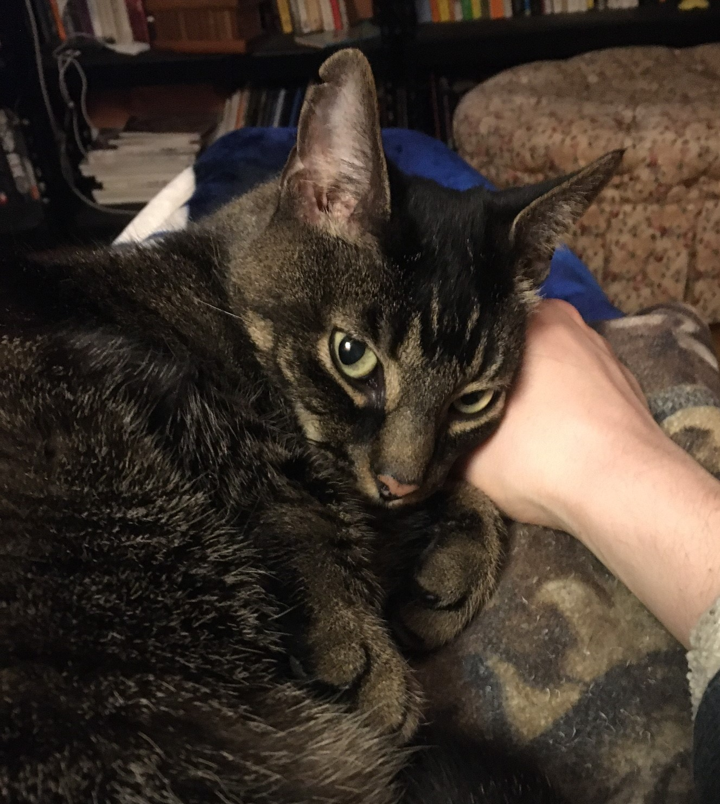

README
================

## DrvienData Pawsitive Predictive Value: Pets and Productivity Entry

On April 1st, 2022 [DrvienData](https://www.drivendata.org/) announced a
competition called [Pawsitive Predictive Value: Pets and Productivity
Entry](https://www.drivendata.org/competitions/95/pawsitive-predictive-value/page/477/).
Briefly, the competition was described as an effort to predict
productivity, in lines of code per second, based on physical proximity
to a pet (in meters).

What follows is my winning entry into this competition.

``` r
library(dplyr)
library(ggplot2)
library(readr)
library(flextable)

flextable_style <- function(x) {
  x %>%
    flextable() %>%
    bold(part = "header") %>% # bolds header
    bg(bg = "#D3D3D3", part = "header")  # puts gray background behind the header row
}
```

## Importing Data

DrivenData provided two data sets and a submission template as csv
files.

``` r
train <- read_csv('train.csv')
test <- read_csv('test.csv')
submission_format <- read_csv("submission_format.csv")
```

## Exploratory Data Analysis

I started out producing simple summary statistics of the `train` data
set. The data contains four variables.

-   `id`: a unique identification string for each data point, where each
    point is a per-minute average taken from a workday
-   `distance`: the distance between person and pet, in meters,
-   `pet_name`: the name of the pet, one of `nico`, `poncie`, `teddy`,
    `titus`. These are a likely grouping variable
-   `lines_per_second` lines of code each pet’s person wrote. This is
    the target variable in the `test` set.

``` r
train %>% 
  group_by(pet_name) %>% 
  summarise(mean_distance = round(mean(distance, na.rm = TRUE), 2),
            max_distance = round(max(distance, na.rm = TRUE), 2),
            min_distance = round(min(distance, na.rm = TRUE), 2),
            mean_lines = round(mean(lines_per_sec, na.rm = TRUE), 2),
            max_lines = round(max(lines_per_sec, na.rm = TRUE), 2),
            min_lines = round(min(lines_per_sec, na.rm = TRUE), 2)) %>% 
  flextable_style() %>% 
  htmltools_value()
```

<template id="7b4739ee-4574-454a-8061-332d6b7481c2"><style>
.tabwid table{
  border-spacing:0px !important;
  border-collapse:collapse;
  line-height:1;
  margin-left:auto;
  margin-right:auto;
  border-width: 0;
  display: table;
  margin-top: 1.275em;
  margin-bottom: 1.275em;
  border-color: transparent;
}
.tabwid_left table{
  margin-left:0;
}
.tabwid_right table{
  margin-right:0;
}
.tabwid td {
    padding: 0;
}
.tabwid a {
  text-decoration: none;
}
.tabwid thead {
    background-color: transparent;
}
.tabwid tfoot {
    background-color: transparent;
}
.tabwid table tr {
background-color: transparent;
}
</style><div class="tabwid"><style>.cl-08e1bac0{}.cl-08dc3c80{font-family:'Arial';font-size:11pt;font-weight:bold;font-style:normal;text-decoration:none;color:rgba(0, 0, 0, 1.00);background-color:transparent;}.cl-08dc3c81{font-family:'Arial';font-size:11pt;font-weight:normal;font-style:normal;text-decoration:none;color:rgba(0, 0, 0, 1.00);background-color:transparent;}.cl-08dc3c82{margin:0;text-align:left;border-bottom: 0 solid rgba(0, 0, 0, 1.00);border-top: 0 solid rgba(0, 0, 0, 1.00);border-left: 0 solid rgba(0, 0, 0, 1.00);border-right: 0 solid rgba(0, 0, 0, 1.00);padding-bottom:5pt;padding-top:5pt;padding-left:5pt;padding-right:5pt;line-height: 1;background-color:transparent;}.cl-08dc3c83{margin:0;text-align:right;border-bottom: 0 solid rgba(0, 0, 0, 1.00);border-top: 0 solid rgba(0, 0, 0, 1.00);border-left: 0 solid rgba(0, 0, 0, 1.00);border-right: 0 solid rgba(0, 0, 0, 1.00);padding-bottom:5pt;padding-top:5pt;padding-left:5pt;padding-right:5pt;line-height: 1;background-color:transparent;}.cl-08dc639a{width:54pt;background-color:transparent;vertical-align: middle;border-bottom: 0 solid rgba(0, 0, 0, 1.00);border-top: 0 solid rgba(0, 0, 0, 1.00);border-left: 0 solid rgba(0, 0, 0, 1.00);border-right: 0 solid rgba(0, 0, 0, 1.00);margin-bottom:0;margin-top:0;margin-left:0;margin-right:0;}.cl-08dc639b{width:54pt;background-color:transparent;vertical-align: middle;border-bottom: 0 solid rgba(0, 0, 0, 1.00);border-top: 0 solid rgba(0, 0, 0, 1.00);border-left: 0 solid rgba(0, 0, 0, 1.00);border-right: 0 solid rgba(0, 0, 0, 1.00);margin-bottom:0;margin-top:0;margin-left:0;margin-right:0;}.cl-08dc639c{width:54pt;background-color:transparent;vertical-align: middle;border-bottom: 2pt solid rgba(102, 102, 102, 1.00);border-top: 0 solid rgba(0, 0, 0, 1.00);border-left: 0 solid rgba(0, 0, 0, 1.00);border-right: 0 solid rgba(0, 0, 0, 1.00);margin-bottom:0;margin-top:0;margin-left:0;margin-right:0;}.cl-08dc639d{width:54pt;background-color:transparent;vertical-align: middle;border-bottom: 2pt solid rgba(102, 102, 102, 1.00);border-top: 0 solid rgba(0, 0, 0, 1.00);border-left: 0 solid rgba(0, 0, 0, 1.00);border-right: 0 solid rgba(0, 0, 0, 1.00);margin-bottom:0;margin-top:0;margin-left:0;margin-right:0;}.cl-08dc639e{width:54pt;background-color:rgba(211, 211, 211, 1.00);vertical-align: middle;border-bottom: 2pt solid rgba(102, 102, 102, 1.00);border-top: 2pt solid rgba(102, 102, 102, 1.00);border-left: 0 solid rgba(0, 0, 0, 1.00);border-right: 0 solid rgba(0, 0, 0, 1.00);margin-bottom:0;margin-top:0;margin-left:0;margin-right:0;}.cl-08dc639f{width:54pt;background-color:rgba(211, 211, 211, 1.00);vertical-align: middle;border-bottom: 2pt solid rgba(102, 102, 102, 1.00);border-top: 2pt solid rgba(102, 102, 102, 1.00);border-left: 0 solid rgba(0, 0, 0, 1.00);border-right: 0 solid rgba(0, 0, 0, 1.00);margin-bottom:0;margin-top:0;margin-left:0;margin-right:0;}</style><table class='cl-08e1bac0'><thead><tr style="overflow-wrap:break-word;"><td class="cl-08dc639f"><p class="cl-08dc3c82"><span class="cl-08dc3c80">pet_name</span></p></td><td class="cl-08dc639e"><p class="cl-08dc3c83"><span class="cl-08dc3c80">mean_distance</span></p></td><td class="cl-08dc639e"><p class="cl-08dc3c83"><span class="cl-08dc3c80">max_distance</span></p></td><td class="cl-08dc639e"><p class="cl-08dc3c83"><span class="cl-08dc3c80">min_distance</span></p></td><td class="cl-08dc639e"><p class="cl-08dc3c83"><span class="cl-08dc3c80">mean_lines</span></p></td><td class="cl-08dc639e"><p class="cl-08dc3c83"><span class="cl-08dc3c80">max_lines</span></p></td><td class="cl-08dc639e"><p class="cl-08dc3c83"><span class="cl-08dc3c80">min_lines</span></p></td></tr></thead><tbody><tr style="overflow-wrap:break-word;"><td class="cl-08dc639b"><p class="cl-08dc3c82"><span class="cl-08dc3c81">nico</span></p></td><td class="cl-08dc639a"><p class="cl-08dc3c83"><span class="cl-08dc3c81">0.45</span></p></td><td class="cl-08dc639a"><p class="cl-08dc3c83"><span class="cl-08dc3c81">0.9</span></p></td><td class="cl-08dc639a"><p class="cl-08dc3c83"><span class="cl-08dc3c81">0.1</span></p></td><td class="cl-08dc639a"><p class="cl-08dc3c83"><span class="cl-08dc3c81">0.54</span></p></td><td class="cl-08dc639a"><p class="cl-08dc3c83"><span class="cl-08dc3c81">0.9</span></p></td><td class="cl-08dc639a"><p class="cl-08dc3c83"><span class="cl-08dc3c81">0.1</span></p></td></tr><tr style="overflow-wrap:break-word;"><td class="cl-08dc639b"><p class="cl-08dc3c82"><span class="cl-08dc3c81">poncie</span></p></td><td class="cl-08dc639a"><p class="cl-08dc3c83"><span class="cl-08dc3c81">0.43</span></p></td><td class="cl-08dc639a"><p class="cl-08dc3c83"><span class="cl-08dc3c81">0.9</span></p></td><td class="cl-08dc639a"><p class="cl-08dc3c83"><span class="cl-08dc3c81">0.1</span></p></td><td class="cl-08dc639a"><p class="cl-08dc3c83"><span class="cl-08dc3c81">0.54</span></p></td><td class="cl-08dc639a"><p class="cl-08dc3c83"><span class="cl-08dc3c81">0.9</span></p></td><td class="cl-08dc639a"><p class="cl-08dc3c83"><span class="cl-08dc3c81">0.1</span></p></td></tr><tr style="overflow-wrap:break-word;"><td class="cl-08dc639b"><p class="cl-08dc3c82"><span class="cl-08dc3c81">teddy</span></p></td><td class="cl-08dc639a"><p class="cl-08dc3c83"><span class="cl-08dc3c81">0.43</span></p></td><td class="cl-08dc639a"><p class="cl-08dc3c83"><span class="cl-08dc3c81">0.9</span></p></td><td class="cl-08dc639a"><p class="cl-08dc3c83"><span class="cl-08dc3c81">0.1</span></p></td><td class="cl-08dc639a"><p class="cl-08dc3c83"><span class="cl-08dc3c81">0.50</span></p></td><td class="cl-08dc639a"><p class="cl-08dc3c83"><span class="cl-08dc3c81">0.9</span></p></td><td class="cl-08dc639a"><p class="cl-08dc3c83"><span class="cl-08dc3c81">0.1</span></p></td></tr><tr style="overflow-wrap:break-word;"><td class="cl-08dc639d"><p class="cl-08dc3c82"><span class="cl-08dc3c81">titus</span></p></td><td class="cl-08dc639c"><p class="cl-08dc3c83"><span class="cl-08dc3c81">0.46</span></p></td><td class="cl-08dc639c"><p class="cl-08dc3c83"><span class="cl-08dc3c81">0.9</span></p></td><td class="cl-08dc639c"><p class="cl-08dc3c83"><span class="cl-08dc3c81">0.1</span></p></td><td class="cl-08dc639c"><p class="cl-08dc3c83"><span class="cl-08dc3c81">0.51</span></p></td><td class="cl-08dc639c"><p class="cl-08dc3c83"><span class="cl-08dc3c81">0.9</span></p></td><td class="cl-08dc639c"><p class="cl-08dc3c83"><span class="cl-08dc3c81">0.1</span></p></td></tr></tbody></table></div></template>
<div class="flextable-shadow-host" id="3f678e87-3d38-4ef0-9679-d5ff63eee4c5"></div>
<script>
var dest = document.getElementById("3f678e87-3d38-4ef0-9679-d5ff63eee4c5");
var template = document.getElementById("7b4739ee-4574-454a-8061-332d6b7481c2");
var caption = template.content.querySelector("caption");
if(caption) {
  caption.style.cssText = "display:block;text-align:center;";
  var newcapt = document.createElement("p");
  newcapt.appendChild(caption)
  dest.parentNode.insertBefore(newcapt, dest.previousSibling);
}
var fantome = dest.attachShadow({mode: 'open'});
var templateContent = template.content;
fantome.appendChild(templateContent);
</script>

These are curious values because they’re all between 0.1 and 0.9.
Normalized values are commonly used in data science, and I considered
the possibility that DrivenData had provided them instead of raw values.
There are a few issues with that possibility though.

1.  Normalized values have a maximum of 1, which is the value for the
    largest raw value. Maximum values for both `distance` and
    `lines_per_sec` in this data set are \~0.9.

2.  There’s only approximately one order of magnitude between the
    minimum and maximum values. That, together with the observed `min`
    and `max` means that either a person’s pet is always within say 1 to
    9 meters of them, or 10 to 90 etc. and the data is normalized, or
    actually within 0.1 to \~ 0.9 meter of that person, and the data
    isn’t normalized. Anyone with pets knows that pets are sometimes
    within less than a meter of their person, so that they can be, you
    know, petted. Sometimes though pets are in another room, eating,
    using a litter box, napping, etc. So a range of 0.1 to 0.9 meters
    doesn’t make sense, but neither does 1 to 9 meters. Anything larger
    than 1 to 9 meters becomes difficult to fit in an apartment or
    house.

3.  DrivenData didn’t say the data was normalized, and they’re good
    about providing accurate descriptions of data sets.

At this point I started to become suspicious.

My next step, common in EDA, was to work up some visualizations of the
data. Plotting `lines_per_sec` vs. `distance` seemed like an obvious
answer. When looking at productivity data I expect to see fluctuations
throughout the day. People talk lunch breaks, go to the bathroom, check
Stack Overflow, pet their pets. Some of this should be visible in the
data.

``` r
train %>%
  ggplot() +
  geom_point(aes(x = distance, y = lines_per_sec)) +
  facet_grid(.~pet_name) +
  scale_x_continuous(breaks = seq(0, 1, 0.2)) +
  scale_y_continuous(breaks = seq(0, 1, 0.2)) +
  theme_bw()
```

<!-- -->

Ah, I see what’s going on. April 1st, April Fools Day. Got it. However,
just because this competition is a joke doesn’t mean it can’t be won.

## Fitting Test Data

There seem to be some missing data points. Let’s look at the `test` data
and see if they fit those holes.

``` r
# test set doesn't have values for lines_per_sec
# make them all 0.5 to put them in the center of the plot for easy viewing
full <- train %>%
  bind_rows(test, .id = 'set') %>%
  replace(is.na(.), 0.5) 

full %>%
  ggplot() +
  geom_point(aes(x = distance, y = lines_per_sec, color = set)) +
  facet_grid(.~pet_name) +
  scale_x_continuous(breaks = seq(0, 1, 0.2)) +
  scale_y_continuous(breaks = seq(0, 1, 0.2)) +
  theme_bw()
```

<!-- -->

The `test` data points *do* line up up with the holes in the `train`
set, at least with respect to `distance`. Let’s try and get them to line
up with respect to `lines_per_sec` as well.

Here’s where normally I’d expect to use some high powered machine
learning library, like Keras or TensorFlow/sklearn in Python, or maybe
Caret in R. I didn’t do that this time though. I just used the good ol’
line formulas from middle school and eye-balled some values.


The values for `b` (y intercept) I was seeing were `0.4`, `0.39`, `0.41`
and `0.39`. Again I was suspicious. Maybe all these intercepts are the
same. Hmmm `0.41` … `41` … 4-1 … April 1st. I played a hunch and set all
`b = 0.41`.

The slopes of all four lines clearly aren’t the same, but they do follow
a similar theme. Two slopes, those for `nico` and `titus` did come out
to about `0.41`. The other two, for `poncie` and `teddy` were about
`0.041`. Again I went with my hunch and set `m = 0.41` for `nico` and
`titus` and `m = 0.041` for `poncie` and `teddy`.

Here’s the result:

``` r
slope <- full %>%
  mutate(lines_per_sec = case_when(
    pet_name == 'nico' & set == '2' ~ (distance * 0.41) + 0.41,
    TRUE ~ lines_per_sec
  )) %>%
  mutate(lines_per_sec = case_when(
    pet_name == 'poncie' & set == '2' ~ (distance * -0.041) + 0.41,
    TRUE ~ lines_per_sec
  )) %>%
  mutate(lines_per_sec = case_when(
    pet_name == 'teddy' & set == '2' ~ (distance * 0.041) + 0.41,
    TRUE ~ lines_per_sec
  )) %>%
  mutate(lines_per_sec = case_when(
    pet_name == 'titus' & set == '2' ~ (distance * 0.41) + 0.41,
    TRUE ~ lines_per_sec
  )) %>%
  mutate(random = runif(nrow(.), min = -0.01, max = 0.01))

slope %>%
  ggplot() +
  geom_point(aes(x = distance, y = lines_per_sec, color = set)) +
  facet_grid(.~pet_name) +
  scale_x_continuous(breaks = seq(0, 1, 0.2)) +
  scale_y_continuous(breaks = seq(0, 1, 0.2)) +
  theme_bw()
```

<!-- -->

So the `test` data fits, but there are some gaps. Looking at the `test`
data set showed why.

## Offsets

``` r
test %>% 
  group_by(distance, pet_name) %>% 
  summarise(n = n()) %>% 
  arrange(desc(n)) %>% 
  head() %>% 
  flextable_style() %>% 
  htmltools_value()
```

<template id="af349893-b8ad-4992-9668-1eb22b6e1045"><style>
.tabwid table{
  border-spacing:0px !important;
  border-collapse:collapse;
  line-height:1;
  margin-left:auto;
  margin-right:auto;
  border-width: 0;
  display: table;
  margin-top: 1.275em;
  margin-bottom: 1.275em;
  border-color: transparent;
}
.tabwid_left table{
  margin-left:0;
}
.tabwid_right table{
  margin-right:0;
}
.tabwid td {
    padding: 0;
}
.tabwid a {
  text-decoration: none;
}
.tabwid thead {
    background-color: transparent;
}
.tabwid tfoot {
    background-color: transparent;
}
.tabwid table tr {
background-color: transparent;
}
</style><div class="tabwid"><style>.cl-13d300f6{}.cl-13cd5b74{font-family:'Arial';font-size:11pt;font-weight:bold;font-style:normal;text-decoration:none;color:rgba(0, 0, 0, 1.00);background-color:transparent;}.cl-13cd5b75{font-family:'Arial';font-size:11pt;font-weight:normal;font-style:normal;text-decoration:none;color:rgba(0, 0, 0, 1.00);background-color:transparent;}.cl-13cd8284{margin:0;text-align:right;border-bottom: 0 solid rgba(0, 0, 0, 1.00);border-top: 0 solid rgba(0, 0, 0, 1.00);border-left: 0 solid rgba(0, 0, 0, 1.00);border-right: 0 solid rgba(0, 0, 0, 1.00);padding-bottom:5pt;padding-top:5pt;padding-left:5pt;padding-right:5pt;line-height: 1;background-color:transparent;}.cl-13cd8285{margin:0;text-align:left;border-bottom: 0 solid rgba(0, 0, 0, 1.00);border-top: 0 solid rgba(0, 0, 0, 1.00);border-left: 0 solid rgba(0, 0, 0, 1.00);border-right: 0 solid rgba(0, 0, 0, 1.00);padding-bottom:5pt;padding-top:5pt;padding-left:5pt;padding-right:5pt;line-height: 1;background-color:transparent;}.cl-13cda994{width:54pt;background-color:transparent;vertical-align: middle;border-bottom: 0 solid rgba(0, 0, 0, 1.00);border-top: 0 solid rgba(0, 0, 0, 1.00);border-left: 0 solid rgba(0, 0, 0, 1.00);border-right: 0 solid rgba(0, 0, 0, 1.00);margin-bottom:0;margin-top:0;margin-left:0;margin-right:0;}.cl-13cda995{width:54pt;background-color:transparent;vertical-align: middle;border-bottom: 0 solid rgba(0, 0, 0, 1.00);border-top: 0 solid rgba(0, 0, 0, 1.00);border-left: 0 solid rgba(0, 0, 0, 1.00);border-right: 0 solid rgba(0, 0, 0, 1.00);margin-bottom:0;margin-top:0;margin-left:0;margin-right:0;}.cl-13cda996{width:54pt;background-color:transparent;vertical-align: middle;border-bottom: 2pt solid rgba(102, 102, 102, 1.00);border-top: 0 solid rgba(0, 0, 0, 1.00);border-left: 0 solid rgba(0, 0, 0, 1.00);border-right: 0 solid rgba(0, 0, 0, 1.00);margin-bottom:0;margin-top:0;margin-left:0;margin-right:0;}.cl-13cda997{width:54pt;background-color:transparent;vertical-align: middle;border-bottom: 2pt solid rgba(102, 102, 102, 1.00);border-top: 0 solid rgba(0, 0, 0, 1.00);border-left: 0 solid rgba(0, 0, 0, 1.00);border-right: 0 solid rgba(0, 0, 0, 1.00);margin-bottom:0;margin-top:0;margin-left:0;margin-right:0;}.cl-13cda998{width:54pt;background-color:rgba(211, 211, 211, 1.00);vertical-align: middle;border-bottom: 2pt solid rgba(102, 102, 102, 1.00);border-top: 2pt solid rgba(102, 102, 102, 1.00);border-left: 0 solid rgba(0, 0, 0, 1.00);border-right: 0 solid rgba(0, 0, 0, 1.00);margin-bottom:0;margin-top:0;margin-left:0;margin-right:0;}.cl-13cda999{width:54pt;background-color:rgba(211, 211, 211, 1.00);vertical-align: middle;border-bottom: 2pt solid rgba(102, 102, 102, 1.00);border-top: 2pt solid rgba(102, 102, 102, 1.00);border-left: 0 solid rgba(0, 0, 0, 1.00);border-right: 0 solid rgba(0, 0, 0, 1.00);margin-bottom:0;margin-top:0;margin-left:0;margin-right:0;}</style><table class='cl-13d300f6'><thead><tr style="overflow-wrap:break-word;"><td class="cl-13cda998"><p class="cl-13cd8284"><span class="cl-13cd5b74">distance</span></p></td><td class="cl-13cda999"><p class="cl-13cd8285"><span class="cl-13cd5b74">pet_name</span></p></td><td class="cl-13cda998"><p class="cl-13cd8284"><span class="cl-13cd5b74">n</span></p></td></tr></thead><tbody><tr style="overflow-wrap:break-word;"><td class="cl-13cda994"><p class="cl-13cd8284"><span class="cl-13cd5b75">0.2088834</span></p></td><td class="cl-13cda995"><p class="cl-13cd8285"><span class="cl-13cd5b75">nico</span></p></td><td class="cl-13cda994"><p class="cl-13cd8284"><span class="cl-13cd5b75">28</span></p></td></tr><tr style="overflow-wrap:break-word;"><td class="cl-13cda994"><p class="cl-13cd8284"><span class="cl-13cd5b75">0.2491942</span></p></td><td class="cl-13cda995"><p class="cl-13cd8285"><span class="cl-13cd5b75">titus</span></p></td><td class="cl-13cda994"><p class="cl-13cd8284"><span class="cl-13cd5b75">27</span></p></td></tr><tr style="overflow-wrap:break-word;"><td class="cl-13cda994"><p class="cl-13cd8284"><span class="cl-13cd5b75">0.3031829</span></p></td><td class="cl-13cda995"><p class="cl-13cd8285"><span class="cl-13cd5b75">poncie</span></p></td><td class="cl-13cda994"><p class="cl-13cd8284"><span class="cl-13cd5b75">27</span></p></td></tr><tr style="overflow-wrap:break-word;"><td class="cl-13cda994"><p class="cl-13cd8284"><span class="cl-13cd5b75">0.2299803</span></p></td><td class="cl-13cda995"><p class="cl-13cd8285"><span class="cl-13cd5b75">poncie</span></p></td><td class="cl-13cda994"><p class="cl-13cd8284"><span class="cl-13cd5b75">26</span></p></td></tr><tr style="overflow-wrap:break-word;"><td class="cl-13cda994"><p class="cl-13cd8284"><span class="cl-13cd5b75">0.2666168</span></p></td><td class="cl-13cda995"><p class="cl-13cd8285"><span class="cl-13cd5b75">titus</span></p></td><td class="cl-13cda994"><p class="cl-13cd8284"><span class="cl-13cd5b75">26</span></p></td></tr><tr style="overflow-wrap:break-word;"><td class="cl-13cda996"><p class="cl-13cd8284"><span class="cl-13cd5b75">0.4473280</span></p></td><td class="cl-13cda997"><p class="cl-13cd8285"><span class="cl-13cd5b75">nico</span></p></td><td class="cl-13cda996"><p class="cl-13cd8284"><span class="cl-13cd5b75">26</span></p></td></tr></tbody></table></div></template>
<div class="flextable-shadow-host" id="776a5b0f-d03e-46ff-bd0e-a5862fa9816e"></div>
<script>
var dest = document.getElementById("776a5b0f-d03e-46ff-bd0e-a5862fa9816e");
var template = document.getElementById("af349893-b8ad-4992-9668-1eb22b6e1045");
var caption = template.content.querySelector("caption");
if(caption) {
  caption.style.cssText = "display:block;text-align:center;";
  var newcapt = document.createElement("p");
  newcapt.appendChild(caption)
  dest.parentNode.insertBefore(newcapt, dest.previousSibling);
}
var fantome = dest.attachShadow({mode: 'open'});
var templateContent = template.content;
fantome.appendChild(templateContent);
</script>

For lots of `pet_name`-`distance` pairs there are many data points.
Presumably those data points should be spread across a range of
`lines_per_sec` values to fill in the gaps in the graph above. Doing so
isn’t possible though. Here’s why:

Assume a set of 3 data points:

``` r
example <- data.frame(distance = c(1, 1, 1, 1, 1, 1),
                      lines_per_sec = c(0.9, 1, 1.1, 1.1, 0.9, 1),
                      id = rep(c(1, 2, 3), 2),
                      set = c(rep('predicted', 3), rep('actual', 3))) %>% 
  mutate(set = factor(set, levels = c('predicted', 'actual')))

example %>% 
  ggplot() +
  geom_point(aes(x = distance, y = lines_per_sec, color = as.factor(id))) +
  scale_x_continuous(breaks = c(1)) +
  facet_wrap(. ~ set) +
  theme_bw() +
  labs(color = 'id')
```

<!-- -->

Even though all the predicted positions match the actual positions they
don’t match on a per-point basis. All the correct positions are
occupied, but they’re occupied by the wrong data points. There’s no way
of determining which data point with `distance = 1` corresponds to which
value of `lines_per_sec`.

So while I originally considered adding a small offset to each value of
`lines_per_sec` I was calculating using my line formulas to fill in the
gaps I decided against it. If I put all the `test` data points in the
centers of their corresponding `train` data holes I’d at least be sure
to place some points correctly. Using offsets I might end up in the
situation illustrated above where none were in the correct spot.

## Submission

Formatting my final submission:

``` r
gp_6 <- slope %>%
  filter(set == '2') %>%
  arrange(id) %>%
  select(id, lines_per_sec) %>%
  right_join(submission_format %>% select(id))

write.csv(gp_6, 'gp_6.csv', row.names = FALSE)
```

## Result

This was a fun little joke, and an enjoyable puzzle, which I’m glad to
have won. I’d like to thank DrivenData, the Academy, the entire cast and
crew, and of course my own pet, Wurlie, who helped a great deal when he
wasn’t being a huge hindrance…



------------------------------------------------------------------------



------------------------------------------------------------------------

I hope you enjoyed this little write up, thanks for reading.
